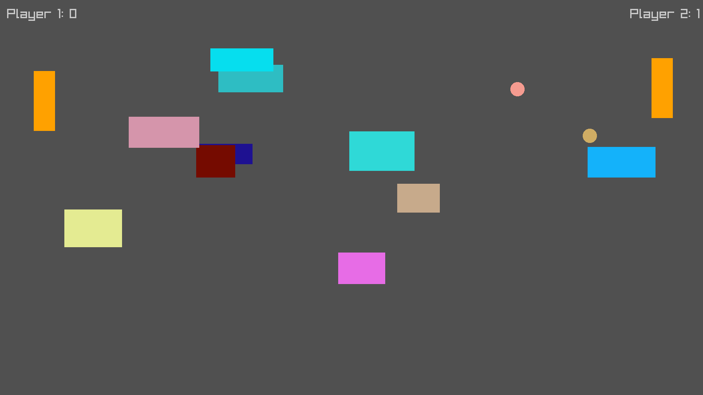

# Pong

Pong is an exciting twist on the classic Pong game, allowing **two players** (either human vs. human or human vs. computer) to compete in a dynamic Pong experience. The game features multiple options for customization, including **additional balls**, **obstacles** on the playfield, and even **moving obstacles** that make the gameplay more challenging and fun.

This version uses **raylib** for graphics and window management, and **Nlohmann JSON** for saving game data and settings.

### Core Gameplay
- **Two-player mode** – Play against a friend or challenge the computer.
- **Multiple Ball Options** – Add extra balls to increase the chaos and fun!
- **Obstacles** – Static obstacles can be placed on the field to block the ball's path.
- **Moving Obstacles** – Dynamic obstacles that move around the screen, adding an extra layer of difficulty.

